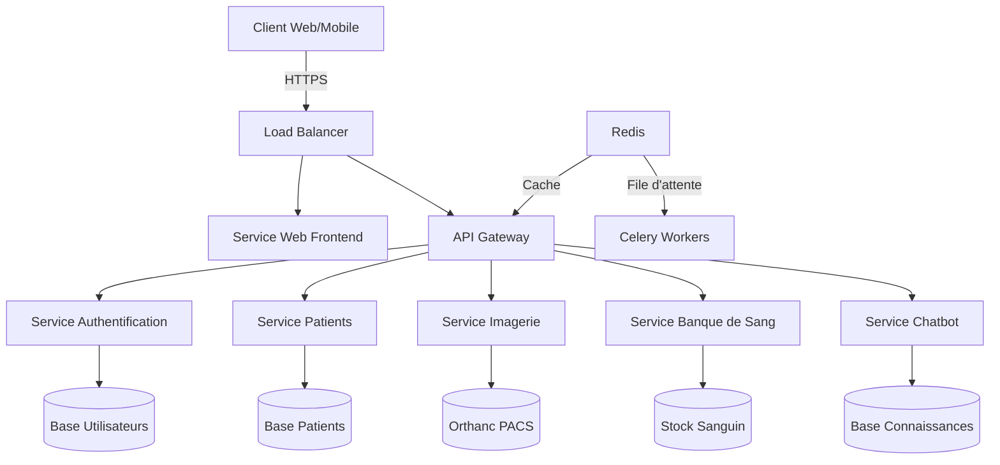
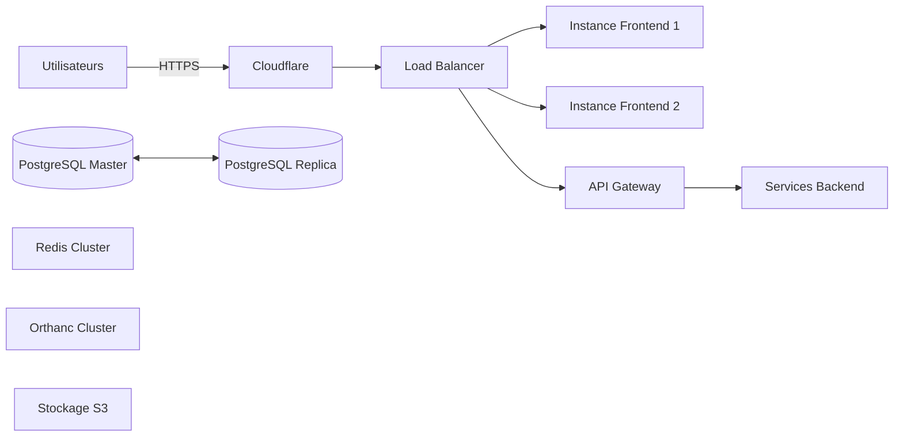
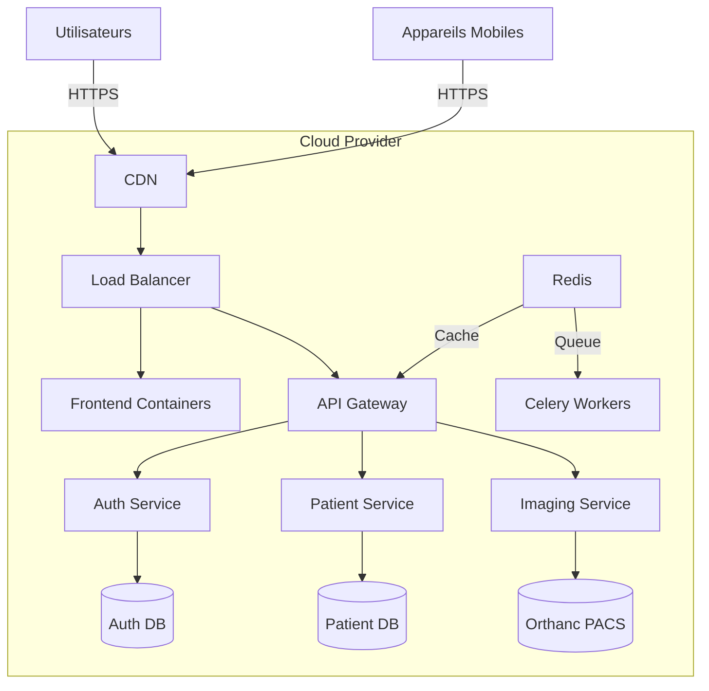
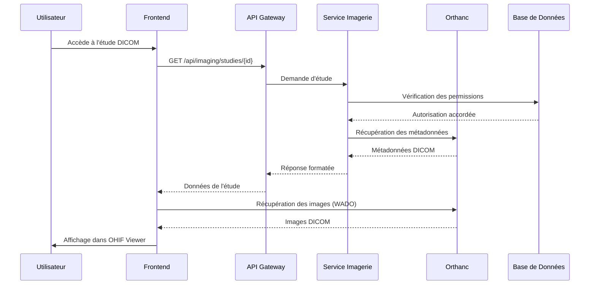
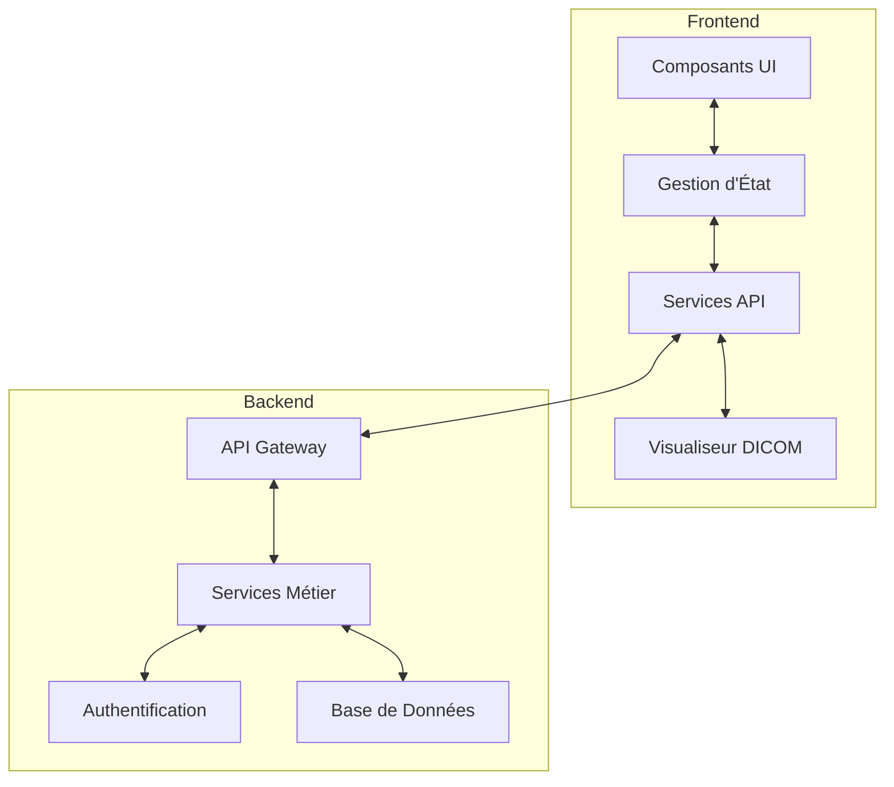

# Architecture du Système MedLink

## Table des Matières
1. [Vue d'Ensemble](#vue-densemble)
2. [Architecture Logicielle](#architecture-logicielle)
3. [Architecture Technique](#architecture-technique)
4. [Diagrammes d'Architecture](#diagrammes-darchitecture)
5. [Décisions d'Architecture Clés](#décisions-darchitecture-clés)
6. [Évolutivité et Performance](#évolutivité-et-performance)

## Vue d'Ensemble

MedLink suit une architecture microservices conteneurisée avec une séparation claire entre les différentes couches :

## Architecture Logicielle

### Pattern d'Architecture
- **Frontend** : Architecture SPA (Single Page Application) avec Vue.js 3
- **Backend** : Architecture RESTful avec Django REST Framework
- **Base de données** : PostgreSQL avec schéma relationnel
- **Cache** : Redis pour les sessions et le cache applicatif
- **Traitements asynchrones** : Celery pour les tâches en arrière-plan

### Composants Principaux

#### 1. Frontend
- **Framework** : Vue.js 3 (Composition API)
- **Gestion d'état** : Pinia
- **Routage** : Vue Router
- **UI** : Tailwind CSS + Headless UI
- **Visualisation DICOM** : OHIF Viewer
- **Cartographie** : Leaflet.js

#### 2. Backend
- **Framework** : Django 4.2
- **API** : Django REST Framework
- **Authentification** : JWT + SimpleJWT
- **Base de données** : PostgreSQL 14 avec PostGIS
- **Cache** : Redis
- **File d'attente** : Celery
- **Stockage fichiers** : AWS S3/MinIO

## Architecture Technique

### Infrastructure

### Sécurité
- **Chiffrement** : TLS 1.3 pour les données en transit
- **Stockage** : Données sensibles chiffrées (AES-256)
- **Authentification** : JWT avec expiration courte + refresh tokens
- **Autorisation** : RBAC (Role-Based Access Control)
- **Audit** : Journalisation complète des accès

## Diagrammes d'Architecture

### 1. Diagramme de Déploiement

### 2. Diagramme de Séquence - Consultation d'Images

### 3. Diagramme de Composants

## Décisions d'Architecture Clés

### 1. Microservices vs Monolithe
- **Choix** : Architecture hybride avec backend monolithique modulaire
- **Raison** : Réduction de la complexité opérationnelle tout en maintenant une séparation claire des préoccupations
- **Avantages** :
  - Développement et déploiement simplifiés
  - Meilleure maintenabilité
  - Évolution progressive vers les microservices si nécessaire

### 2. Stockage des Images Médicales
- **Solution** : Orthanc PACS
- **Avantages** :
  - Conforme DICOM
  - API REST complète
  - Compression et déduplication intégrées

### 3. Gestion des Sessions
- **Approche** : JWT stateless
- **Avantages** :
  - Scalabilité horizontale
  - Réduction de la charge sur la base de données
  - Support natif des applications mobiles

## Évolutivité et Performance

### Stratégies d'Évolutivité
1. **Horizontale** : Ajout de nœuds pour les services sous charge
2. **Verticale** : Augmentation des ressources des machines
3. **Cache** : Mise en cache à plusieurs niveaux (CDN, Redis)
4. **Base de données** : Réplication en lecture, partitionnement

### Métriques de Performance
- **Temps de réponse API** : < 500ms pour 95% des requêtes
- **Disponibilité** : 99.9% (hors fenêtres de maintenance)
- **Capacité** : Support de 1000 utilisateurs concurrents

### Surveillance
- **Outils** : Prometheus + Grafana
- **Métriques** :
  - Taux de réussite des requêtes
  - Temps de réponse par endpoint
  - Utilisation des ressources
  - File d'attente des tâches asynchrones

## Conclusion

L'architecture de MedLink a été conçue pour être :
- **Robuste** : Tolérance aux pannes intégrée
- **Sécurisée** : Protection des données sensibles
- **Évolutive** : Capacité à gérer la croissance
- **Maintenable** : Séparation claire des responsabilités

Cette architecture permet de répondre aux besoins actuels tout en offrant une base solide pour les évolutions futures.
