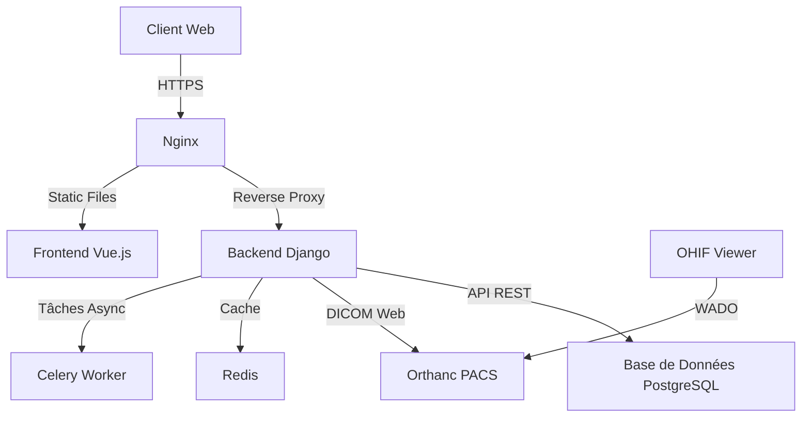
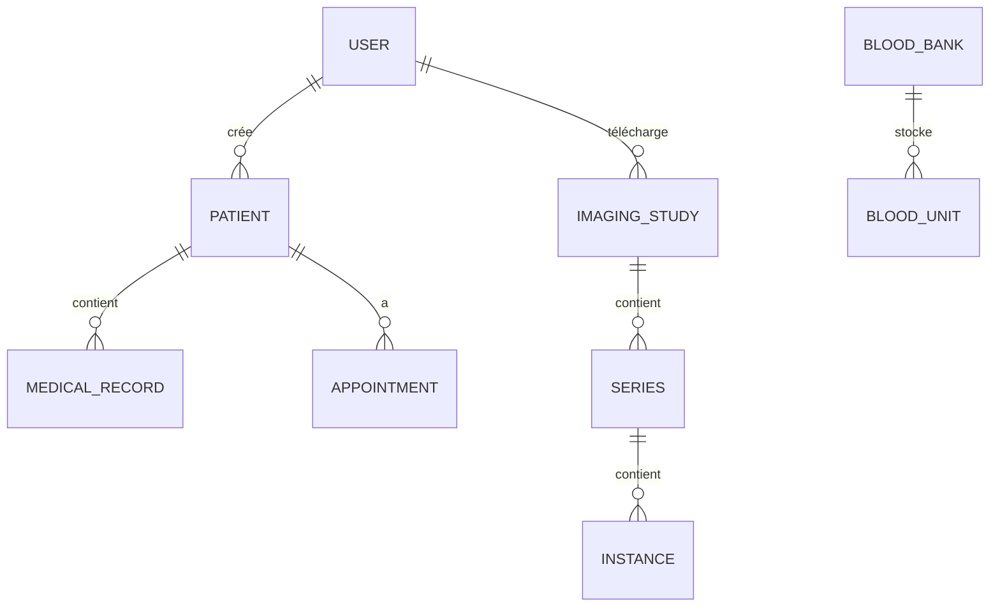

# Documentation Technique - MedLink

## Table des Matières
1. [Architecture du Système](#architecture-du-système)
2. [Structure du Projet](#structure-du-projet)
3. [Configuration et Déploiement](#configuration-et-déploiement)
4. [API Documentation](#api-documentation)
5. [Sécurité](#sécurité)
6. [Base de Données](#base-de-données)
7. [Intégration Continue/Déploiement Continu](#intégration-continuedéploiement-continu)
8. [Dépannage](#dépannage)

## Architecture du Système

### Vue d'Ensemble
MedLink suit une architecture microservices conteneurisée avec les composants principaux suivants :



### Composants Techniques

#### Backend (Django)
- **Framework** : Django 4.2 avec Django REST Framework
- **Authentification** : JWT avec SimpleJWT
- **Base de données** : PostgreSQL avec PostGIS
- **Cache** : Redis
- **File d'attente** : Celery avec Redis comme broker
- **Stockage** : AWS S3 (ou stockage local pour le développement)

#### Frontend (Vue.js 3)
- **Framework** : Vue 3 (Composition API)
- **Gestion d'état** : Pinia
- **Routage** : Vue Router
- **UI** : Tailwind CSS + Headless UI
- **Visualisation DICOM** : OHIF Viewer
- **Cartographie** : Leaflet.js

#### Infrastructure
- **Conteneurisation** : Docker + Docker Compose
- **Orchestration** : Kubernetes (optionnel)
- **Monitoring** : Prometheus + Grafana
- **Logs** : ELK Stack
- **CI/CD** : GitHub Actions

## Structure du Projet

```
medlink/
├── backend/                 # Application Django
│   ├── authentication/      # Gestion des utilisateurs
│   ├── patients/           # Gestion des dossiers patients
│   ├── imaging/            # Intégration Orthanc
│   ├── chatbot/            # Module de chatbot
│   ├── bloodbank/          # Gestion de la banque de sang
│   └── core/               # Configuration Django
├── frontend/               # Application Vue.js
│   ├── public/             # Fichiers statiques
│   ├── src/
│   │   ├── api/           # Appels API
│   │   ├── assets/        # Ressources statiques
│   │   ├── components/    # Composants réutilisables
│   │   ├── router/        # Configuration des routes
│   │   ├── stores/        # Gestion d'état (Pinia)
│   │   └── views/         # Pages de l'application
│   └── tests/             # Tests frontend
├── docker/                 # Fichiers de configuration Docker
├── docs/                   # Documentation
└── scripts/                # Scripts utilitaires
```

## Configuration et Déploiement

### Variables d'Environnement
Créez un fichier `.env` à la racine du projet avec les variables suivantes :

```env
# Django
DEBUG=True
SECRET_KEY=votre_secret_key
ALLOWED_HOSTS=localhost,127.0.0.1

# Base de données
POSTGRES_DB=medlink
POSTGRES_USER=postgres
POSTGRES_PASSWORD=postgres
POSTGRES_HOST=db
POSTGRES_PORT=5432

# Orthanc
ORTHANC_URL=http://orthanc:8042
ORTHANC_USERNAME=orthanc
ORTHANC_PASSWORD=orthanc

# Email
EMAIL_HOST=smtp.example.com
EMAIL_PORT=587
EMAIL_USE_TLS=True
EMAIL_HOST_USER=user@example.com
EMAIL_HOST_PASSWORD=password

# JWT
JWT_SECRET_KEY=votre_jwt_secret
JWT_ALGORITHM=HS256
ACCESS_TOKEN_LIFETIME=1440  # minutes
REFRESH_TOKEN_LIFETIME=10080  # minutes
```

### Déploiement avec Docker

1. **Cloner le dépôt** :
   ```bash
   git clone https://github.com/votre-utilisateur/medlink.git
   cd medlink
   ```

2. **Créer et démarrer les conteneurs** :
   ```bash
   docker-compose up -d --build
   ```

3. **Appliquer les migrations** :
   ```bash
   docker-compose exec backend python manage.py migrate
   ```

4. **Créer un superutilisateur** :
   ```bash
   docker-compose exec backend python manage.py createsuperuser
   ```

5. **Accéder à l'application** :
   - Frontend : http://localhost:8080
   - Backend Admin : http://localhost:8000/admin
   - Orthanc : http://localhost:8042

## API Documentation

### Authentification

#### Connexion
```http
POST /api/auth/login/
Content-Type: application/json

{
    "email": "utilisateur@example.com",
    "password": "motdepasse"
}
```

#### Rafraîchissement du token
```http
POST /api/auth/token/refresh/
Content-Type: application/json

{
    "refresh": "votre_refresh_token"
}
```

### Endpoints Principaux

#### Patients
- `GET /api/patients/` - Liste des patients
- `POST /api/patients/` - Créer un patient
- `GET /api/patients/{id}/` - Détails d'un patient
- `PUT /api/patients/{id}/` - Mettre à jour un patient

#### Imagerie
- `GET /api/imaging/studies/` - Liste des études DICOM
- `POST /api/imaging/studies/` - Téléverser une étude
- `GET /api/imaging/studies/{id}/` - Détails d'une étude
- `GET /api/imaging/orthanc/` - Proxy vers Orthanc

## Sécurité

### Mesures de Sécurité Implémentées
1. **Authentification** : JWT avec tokens d'accès et de rafraîchissement
2. **CSRF Protection** : Protection intégrée de Django
3. **CORS** : Configuration stricte des origines autorisées
4. **Hachage des mots de passe** : Utilisation de PBKDF2
5. **TLS/SSL** : Chiffrement des données en transit
6. **Validation des entrées** : Sérialiseurs Django REST Framework

### Bonnes Pratiques de Sécurité
- Ne jamais stocker de données sensibles dans le code source
- Utiliser des variables d'environnement pour les secrets
- Mettre à jour régulièrement les dépendances
- Implémenter une politique de mot de passe forte
- Journaliser les activités sensibles

## Base de Données

### Schéma Principal


### Migrations
Pour créer une nouvelle migration :
```bash
docker-compose exec backend python manage.py makemigrations
```

Pour appliquer les migrations :
```bash
docker-compose exec backend python manage.py migrate
```

## Intégration Continue/Déploiement Continu

### GitHub Actions
Le workflow CI/CD est configuré dans `.github/workflows/ci-cd.yml` et effectue :
1. Tests unitaires et d'intégration
2. Analyse statique du code (pylint, eslint)
3. Construction des images Docker
4. Déploiement sur l'environnement de staging/production

### Environnements
- **Développement** : `main` branch
- **Staging** : `staging` branch
- **Production** : `production` branch

## Dépannage

### Problèmes Courants

#### Erreur de connexion à la base de données
```
django.db.utils.OperationalError: could not connect to server: Connection refused
```
**Solution** : Vérifiez que le service PostgreSQL est en cours d'exécution :
```bash
docker-compose ps
docker-compose logs db
```

#### Erreur CSRF
```
Forbidden (CSRF cookie not set)
```
**Solution** : Assurez-vous que :
1. Le cookie CSRF est correctement défini
2. Les en-têtes appropriés sont envoyés avec les requêtes
3. L'origine de la requête est autorisée dans `CORS_ALLOWED_ORIGINS`

#### Problèmes de performances
**Symptômes** : Lenteur des requêtes API
**Solution** :
1. Activer le cache Redis
2. Optimiser les requêtes de base de données
3. Mettre en place la pagination
4. Utiliser `select_related` et `prefetch_related` dans les vues Django

### Support
Pour tout problème technique, veuillez ouvrir une issue sur notre [dépôt GitHub](https://github.com/votre-utilisateur/medlink/issues).
